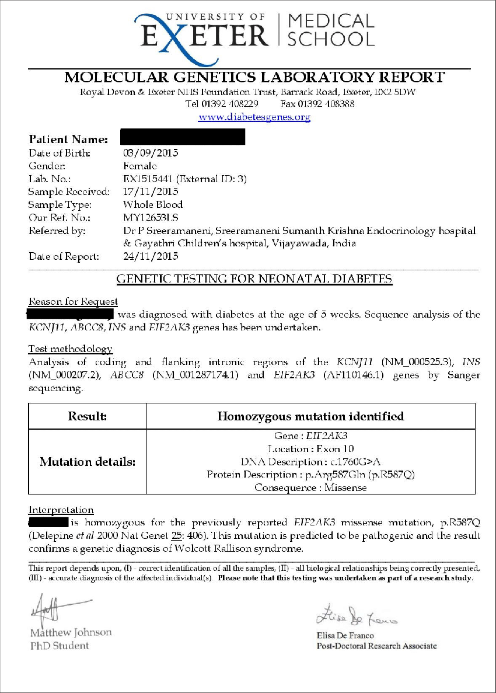
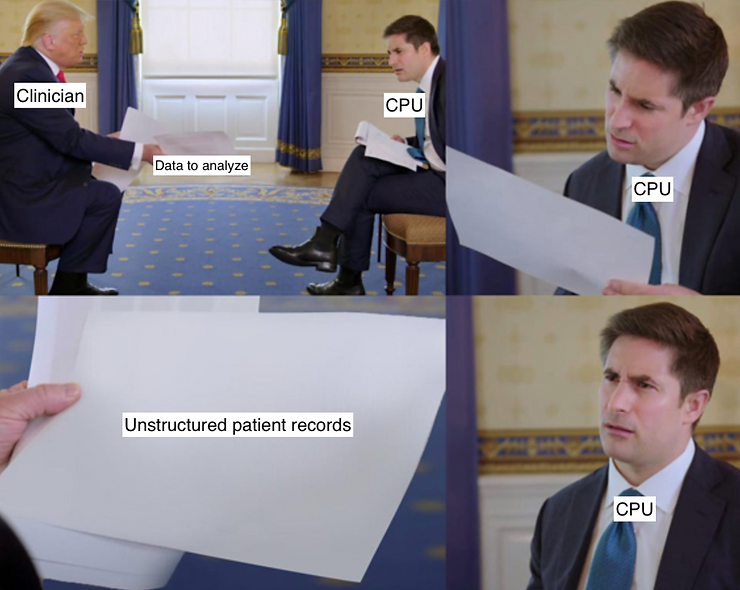

# How to unlock unstructured patient records

## What is an unstructured record?

Unstructured records are your patient records that don’t follow any fixed format or recognizable schema. They're the records you hastily upload into a file folder somewhere and dread having to review again for actionable information. I’m talking about your PDFs, your images, your scanned faxes, or your paper charts. The lab report shown below is a great example. 



## The prevalence and problem of unstructured patient records 

Estimates put the proportion of unstructured patient records at [approximately 80% of all healthcare data](https://www.ncbi.nlm.nih.gov/pmc/articles/PMC6372467/). However, dealing with these records is labor-intensive for our healthcare institutions and clinicians. The seemingly simple task of reviewing unstructured records for key details can be quite a time-consuming and manual ordeal. Furthermore, unstructured records aren’t computable or machine readable, which means extracting the information they hold for research and innovation initiatives is usually prohibitive. 



For big projects, one option is to hire an army of chart-abstracters (a fancy term for labourers who read unstructured patient records and manually enter their key details in a structured database), but that's often slow and expensive.

## OCR to the rescue

Fortunately, advances in optical character recognition (OCR) technology have made it easy, and cheap, to squeeze the value out of your unstructured patient records. OCR is an application of artificial intelligence that can read text in images. And no matter which OCR product you choose from one of the cloud computing market leaders like [AWS](https://aws.amazon.com/textract/ocr/), [Azure](https://azure.microsoft.com/en-ca/products/ai-services/ai-document-intelligence), or [Google Cloud](https://cloud.google.com/document-ai?hl=en), you get all the textual content, typed or handwritten, from your unstructured records for a fraction of a cent per page. It’s pretty miraculous. Have a look at what Microsoft Azure’s OCR can do with my lab report.

```"content": "UNIVERSITY OF EXETER\nMEDICAL SCHOOL\nMOLECULAR GENETICS LABORATORY REPORT Royal Devon & Exeter NIIS Foundation Trust, Barrack Road, Exeter, EX2 5DW Tel 01392 408229 Fax 01392 108388\nwww.diabetesgenes.org\nPalient Name:\nDate of Birth:\nGender:\n03/09/2015\nFemale\nEX1515441 (External ID: 3)\nLab. No .:\nSample Received:\n17/11/2015\nSample Type:\nWhole Blood\nMY12653L.S\nOur Ref. No .:\nReferred by:\nDr P Sreeramaneni, Sreeramaneni Sumanth Krishna Endocrinology hospital\n& Gayathri Children's hospital, Vijayawada, India\nDale of Report:\n24/11/2015\nGENETIC TESTING FOR NEONATAL, DIABETES\nReason for Request\nwas diagnosed with diabetes at the age of 5 weeks. Sequence analysis of the KCNJ11, ABCC8, INS and FIF2AK3 genes has been undertaken.\nTest methodology\nAnalysis of coding and flanking intronic regions of the KCNJ11 (NM_000525.3), INS (NM_000207.2), ABCC8 (NM_001287174.1) and EIF2AK3 (AF110146.1) genes by Sanger sequencing.\nResult:\nHomozygous mutation identified\nMutation details:\nGene : CIT2AK3 Location : Exon 10 DNA Description : c.1760G>A Protein Description : p. Arg587Gln (p.R587Q) Consequence : Missense\nInterpretation\nis homozygous for the previously reported EIF2AK3 missense mutation, p.R587Q (Delepine et al 2000 Nal Genel 25: 406). This mulation is predicted to be pathogenic and the result confirms a genetic diagnosis of Wolcott Rallison syndrome.\nThis report depends upon, (I) - correct identification of all the samples, (II) - all biological relationships being correctly presented, (III) - accurate diagnosis of the affected individual(s). Please note that this testing was undertaken as part of a research study.\nMatthew Johnson PhD Student\nFlisa Le Zano\nElisa De Franco Post-Doctoral Research Associate"```

These OCR products don’t just spit out the raw text, either. They also can read tables and detect titles, headings or subheadings. But what I find potentially most useful for healthcare professionals is their ability to extract key-value pairs. Here's a handful of the key-value pairs that were returned along with the raw text pasted above. The OCR did a pretty great job of pulling out the key details in the lab report.

```"content": "...",
"keyValuePairs": [
  {
    "key": {
      "content": "Tel"
    },
    "value": {
      "content": "01392 408229"
    }
  },
  {
    "key": {
      "content": "Fax"
    },
    "value": {
      "content": "01392 108388"
    }
  },
  {
    "key": {
      "content": "Date of Birth"
    },
    "value": {
      "content": "03/09/2015"
    }
  },
  {
    "key": {
      "content": "Gender"
    },
    "value": {
      "content": "Female"
    }
  },
  {
    "key": {
      "content": "Sample Received"
    },
    "value": {
      "content": "17/11/2015"
    }
  },
  {
    "key": {
      "content": "Sample Type"
    },
    "value": {
      "content": "Whole Blood"
    }
  },
  {
    "key": {
      "content": "Referred by"
    },
    "value": {
      "content": "Dr P Sreeramaneni, Sreeramaneni Sumanth Krishna Endocrinology hospital\n& Gayathri Children's hospital, Vijayawada, India"
    }
  },
  {
    "key": {
      "content": "Date of Report"
    },
    "value": {
      "content": "24/11/2015"
    }
  },
  {
    "key": {
      "content": "Gene"
    },
    "value": {
      "content": "CIT2AK3"
    }
  },
  {
    "key": {
      "content": "Location"
    },
    "value": {
      "content": "Exon 10"
    }
  },
  {
    "key": {
      "content": "DNA Description"
    },
    "value": {
      "content": "c.1760G>A"
    }
  },
  {
    "key": {
      "content": "Protein Description"
    },
    "value": {
      "content": "p. Arg587Gln (p.R587Q)"
    }
  },
  {
    "key": {
      "content": "Consequence"
    },
    "value": {
      "content": "Missense"
    }
  }
]
```

This particularly magical feature converts unstructured patient records into a list of structured data fields, and serves it up on a platter for clinicians, researchers or innovators. This makeover from a crude, unstructured blob of data to a clean, structured JSON file opens a world of new possibilities. For example, you could migrate this newly structured data into an electronic health record and liberate clinicians from the friction incurred when interacting with this data in their point of care workflows. You might also offer the data to a quality improvement team and see where they can find opportunities for better patient outcomes, or offer the data to population health researchers who want to investigate trends, patterns, and risk factors across large patient populations. The use cases are limited only by your imagination.  

## Conclusion

With the [compound annual growth rate of healthcare data worldwide predicted to reach 36% in 2025](https://pubmed.ncbi.nlm.nih.gov/29314515/), unstructured patient records are a problem that is here to stay. You might want to look into this OCR thing.